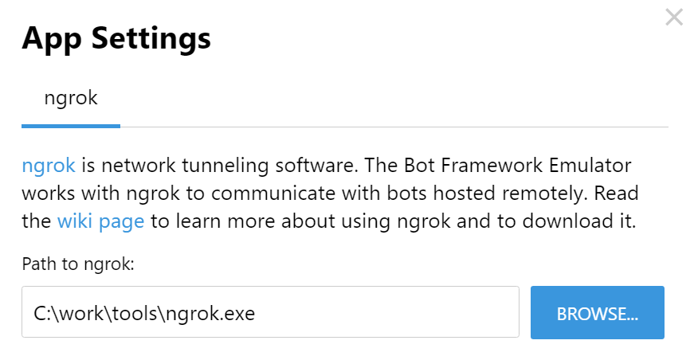
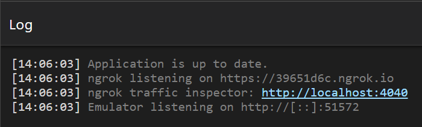
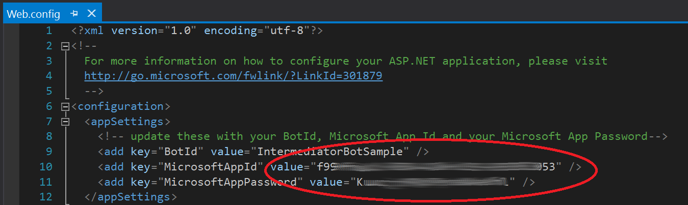
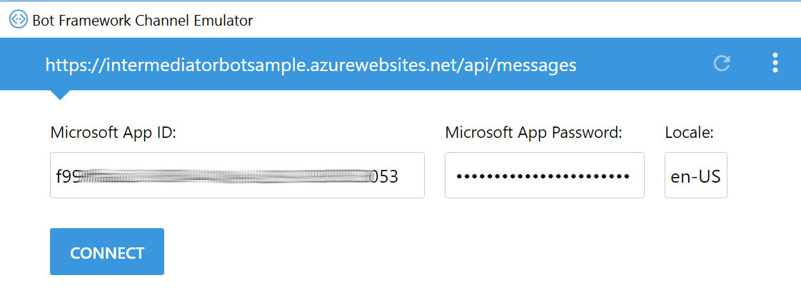

# Intermediator Bot Sample #

A bot build on [Microsoft Bot Framework](https://dev.botframework.com/) that routes messages between
two users on different channels. This is sample utilizes the core functionality found in
[Bot Message Routing (component) project](https://github.com/tompaana/bot-message-routing).

This is a C# sample - if you're looking to do this with Node, see
[this sample](https://github.com/palindromed/Bot-HandOff).

A possible use case for this type of a bot would be a customer service scenario
where the bot relays the messages between a customer and a customer service agent.

## Getting started ##

To test the bot, publish it in
[Microsoft Bot Framework portal](https://dev.botframework.com) and connect it to
the channels of your choice. If you are new to bots, please familiarize yourself
first with the basics [here](https://dev.botframework.com/).
[Microsoft Bot Framework Emulator](https://docs.microsoft.com/en-us/bot-framework/debug-bots-emulator)
is a great tool for testing and debugging - you can download it from
[here](https://github.com/Microsoft/BotFramework-Emulator/releases). To communicate with a remotely
hosted bot, you should use [ngrok](https://ngrok.com/) tunneling software:

1. In emulator open **App Settings**
2. Make sure ngrok path is set:
    
3. See the emulator log to verify the path was set correctly:
    
4. Set the bot end point in emulator (`https://<bot URL>/api/messages`)
5. Set **Microsoft App ID** and **Microsoft App Password**
    * **Note:** It is easy to forget to add the app ID and password to the
      `Web.config` file. Make sure you have the values set before you publish
      the bot:
    
6. Click **CONNECT** to start a new conversation
    

See also: [Microsoft Bot Framework Emulator wiki](https://github.com/microsoft/botframework-emulator/wiki/Getting-Started)

### Scenario 1: Channel <-> channel ###

This scenario utilizes an aggregation concept (see the terminology table in this document). One or
more channels act as aggregated channels where the customer requests (for human assistance) are
sent. The conversation owners (e.g. customer service agents) then accept or reject the requests.

Once you have published the bot, go to the channel you want to receive the requests and issue the
following command to the bot (given that you haven't changed the default bot command handler or the
command itself):

```
@<bot name> watch
```

In case mentions are not supported, you can also use the command keyword:

```
command watch
```

Now all the requests from another channels are forwarded to this channel.
See the default flow below:

| Emulator with ngrok | Slack |
| ------------------- | ----- |
| |  |
|  |  |
| |  |
|  |  |

### Scenario 2: Channel <-> call center (agent UI) ###

In this scenario the conversation owners (e.g. customer service agents) access
the bot via the webchat component, [Agent UI](https://github.com/billba/agent),
implemented by [Bill Barnes](https://github.com/billba). Each customer request
(for human assistance) automatically opens a new chat window in the agent UI.

| Emulator | Agent UI |
| -------- | -------- |
|  |  |

To set this up, follow these steps:

0. Make sure you have [Node.js](https://nodejs.org) installed
1. Clone or download [the Agent UI repository](https://github.com/billba/agent)
2. Inside `index.ts`, update the line below with your bot's endpoint:

    `fetch("http://YOUR_BOT_ENDPOINT/api/agent/1")`
    
    Example: `fetch("http://mybot.azurewebsites.net/api/agent/1")`

3. Inside `index.ts`, update the line below with your bot secret key

    ```js
    iframe.src = 'botchat?s=YOUR_DIRECTLINE_SECRET_ID';
    ```
    
    * The bot secret key can be found in your bot's profile in
      [the portal](https://dev.botframework.com/bots)
    * Click on the **Edit** button next to the **Direct Line** channel to locate the secret key
    
    
    
    * If your **Configure Direct Line** page is blank, create a new site by
      clicking **Add new site** and two bot secret keys will be generated for you:
    
    

4. Run `npm install` to get the npm packages 

    * You only need to run this command once, unless you add other node packages to the project
    * If you encounter `error TS2300`, run `npm install typescript@2.0.10`

5. Run `npm run build` to build the app 

    * You need to run this every time you make changes to the code before you start the application

6. Run `npm run start` to start the app
7. Go to http://localhost:8080 to see the Agent UI

#### Troubleshooting agent UI scenario ####

Make sure that the value of `RejectPendingRequestIfNoAggregationChannel` key in
[Web.config](/IntermediatorBotSample/Web.config) is `false`:

```xml
<add key="<add key="RejectPendingRequestIfNoAggregationChannel" value="false" />" value="false" />
```

Otherwise the agent UI will not receive the requests, but they are automatically rejected
(if no aggregation channel is set).

### Commands ###

The bot comes with
[a CommandMessageHandler class](/IntermediatorBotSample/CommandHandling/CommandMessageHandler.cs),
which implements the commands in the table below.

| Command | Description |
| ------- | ----------- |
| `options` | Displays the command options as a card with buttons (convenient!) |
| `watch` | Marks the current channel as **aggregation** channel (where requests are sent). |
| `accept <user ID>`  | Accepts the conversation connection request of the given user.  |
| `reject <user ID>` | Rejects the conversation connection request of the given user. |
| `disconnect` | Ends the current conversation with a user. |
| `reset` | Deletes all routing data! |
| `list parties` | Lists all parties the bot is aware of. |
| `list requests` | Lists all pending requests. |
| `list conversations` | Lists all conversations (connections). |
| `list results` | Lists all handled results (`MessageRouterResult`). |

To issue a command use the bot name:

```
@<bot name> <command> <optional parameters>
```

In case mentions are not supported, you can also use the command keyword:

```
command <command> <optional parameters>
```

## Implementation ##

The core message routing functionality comes from the
[Bot Message Routing (component)](https://github.com/tompaana/bot-message-routing) project.
This sample demonstrates how to use the component and provides the necessary "plumbing" such as
command handling.

The key classes of this sample are:

* **[AgentController](/IntermediatorBotSample/Controllers/AgentController.cs)**:
  A controller for the agent UI. Enables the agent UI to check the status of pending requests and
  automatically accept them.

* **[BackChannelMessageHandler](/IntermediatorBotSample/CommandHandling/BackChannelMessageHandler.cs)**:
  Provides implementation for checking and acting on back channel (command) messages. Back channel
  messages are used by the agent UI.

* **[CommandMessageHandler](/IntermediatorBotSample/CommandHandling/CommandMessageHandler.cs)**:
  Provides implementation for checking and acting on commands in messages before they are passed to
  a dialog etc.

* **[MessageRouterResultHandler](/IntermediatorBotSample/MessageRouting/MessageRouterResultHandler.cs)**:
  Implements `IMessageRouterResultHandler`. Handles the results of the operations executed by
  `MessageRouterManager`.

See also: [Taking the code into use](#taking-the-code-into-use)

### App settings ###

A number of **app settings** are available in the [Web.config](/IntermediatorBotSample/Web.config)
file of this sample which can be used to tailor the experience.

**PermittedAgentChannels**: If you wish to only allow conversation owners (i.e. customer service
agent) to use a specific channel or channels, you can specify a comma seperated list of channel IDs
here.  This will prevent agent commands from being used on other channels and prevent users from
accidentally or deliberately calling such commands. E.g. to allow agents to use the emulator and
Skype channels you would use.

```
<add key="PermittedAgentChannels" value="emulator,skype" />
```

**RejectPendingRequestIfNoAggregationChannel**: This setting, which is set to true by default, will
cause the LocalRoutingDataManager to return the NoAgentsAvailable result when no agents are watching
for incoming requests. You can then send an appropriate response to let the user know no agents are
available within the implementation of `IMessageRouterResultHandler`. If this is set to false, then
the `LocalRoutingDataManager` will process and add the users request to the pending requests list
and return the `ConnectionRequested` result instead. 

### Taking the code into use ###

The most convenient place to use the aforementioned classes is in the
**[MessagesController](/IntermediatorBotSample/Controllers/MessagesController.cs)**
class - you can first call the methods in `MessageRouterManager` and, for instance, if no action is
taken by the manager, you can forward the `Activity` to a `Dialog`:

```cs
public async Task<HttpResponseMessage> Post([FromBody]Activity activity)
{
    if (activity.Type == ActivityTypes.Message)
    {
        MessageRouterManager messageRouterManager = WebApiConfig.MessageRouterManager;
        IMessageRouterResultHandler messageRouterResultHandler = WebApiConfig.MessageRouterResultHandler;

        messageRouterManager.MakeSurePartiesAreTracked(activity);
                
        // First check for commands (both from back channel and the ones directly typed)
        MessageRouterResult messageRouterResult =
            WebApiConfig.BackChannelMessageHandler.HandleBackChannelMessage(activity);

        if (messageRouterResult.Type != MessageRouterResultType.Connected
            && await WebApiConfig.CommandMessageHandler.HandleCommandAsync(activity) == false)
        {
            // No valid back channel (command) message or typed command detected

            // Let the message router manager instance handle the activity
            messageRouterResult = await messageRouterManager.HandleActivityAsync(activity, false);

            if (messageRouterResult.Type == MessageRouterResultType.NoActionTaken)
            {
                // No action was taken by the message router manager. This means that the
                // user is not connected (in a 1:1 conversation) with a human
                // (e.g. customer service agent) yet.
                //
                // You can, for example, check if the user (customer) needs human
                // assistance here or forward the activity to a dialog. You could also do
                // the check in the dialog too...
                //
                // Here's an example:
                if (!string.IsNullOrEmpty(activity.Text)
                    && activity.Text.ToLower().Contains(CommandRequestConnection))
                {
                    messageRouterResult = messageRouterManager.RequestConnection(activity);
                }
                else
                {
                    await Conversation.SendAsync(activity, () => new RootDialog());
                }
            }
        }

        // Handle the result, if required
        await messageRouterResultHandler.HandleResultAsync(messageRouterResult);
    }
    else
    {
        await HandleSystemMessageAsync(activity);
    }

    var response = Request.CreateResponse(HttpStatusCode.OK);
    return response;
}
```

## See also ##

* [Bot Message Routing (component) project](https://github.com/tompaana/bot-message-routing)
    * [NuGet package](https://www.nuget.org/packages/Underscore.Bot.MessageRouting)
* [Chatbots as Middlemen blog post](http://tomipaananen.azurewebsites.net/?p=1851)
